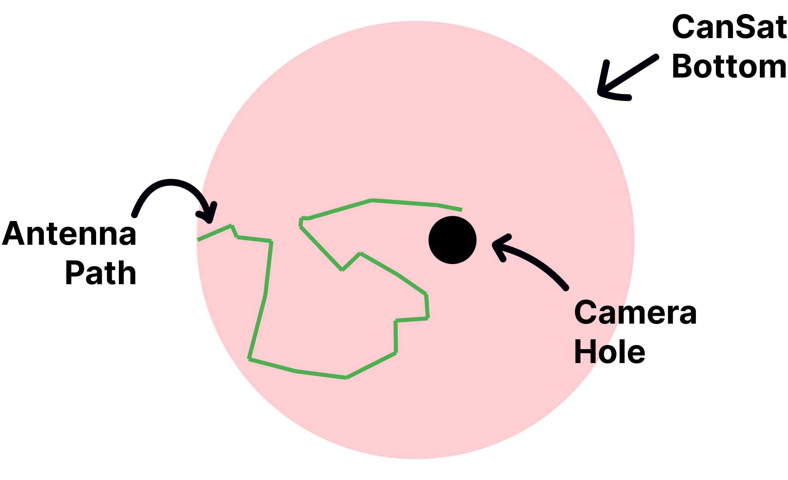
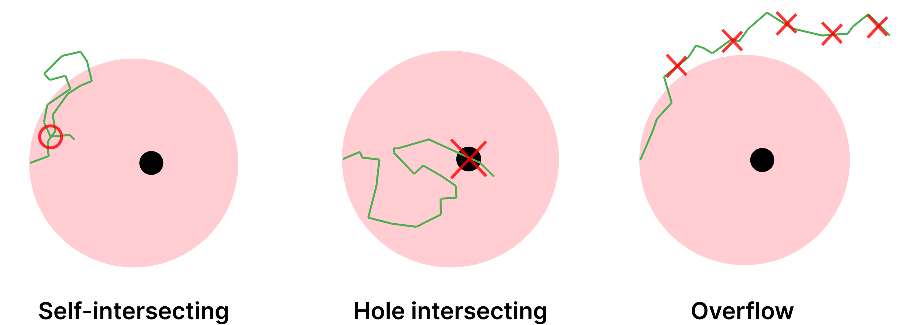
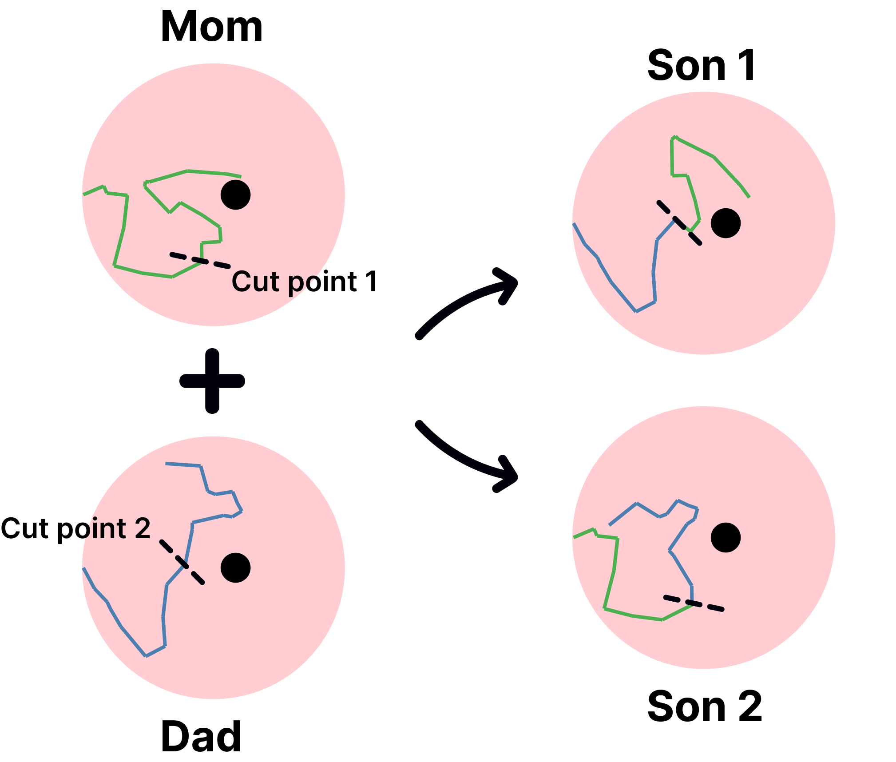
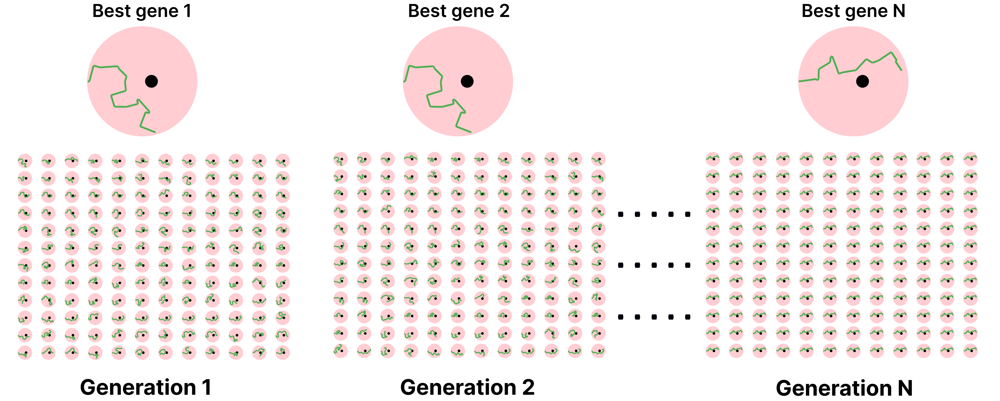

# Planar Evolved Antenna
2-dimensional planar antenna optimized with genetic algorithms.

## Objectives
The main goal of this project is simulating the evolution of a planar antenna subject to space and shape constraints, in order to maximize isotropic gain of the "north" region (toward theta = 0, standar spherical coordinates) and minimize backlobes propagation in the south region. The simulation is carried out through a genetic algorithm framed as described in the following paragraphs.

## Problem representation


### Encoding
A planar antenna can be represented as a path with both cartesian and polar coordinates. The latter is our case (see rod-based robots). Each segment of the polygonal chain is a polar coordinate (angle, distance) whose origin is the end-point of the previous segment. 

### Constraints
Trhoughout the simulation (at any given time of it), every path must be contained inside a circle of diameter _outer\_diameter_ - specified in _config.yaml_ file - and must avoid an inner circle of diameter _inner\_diameter_, namely the hole for the onboard camera.


### Fitness (objective function)
A linear objective function: $f(min\\_gain, std\\_dev) = k1 \cdot min\\_gain + k2 \cdot std\\_dev$

### Crossover and mutation
A single cut-point crossover is done at the moment. Crossover recombines genes from the previous generation to reach _population\_size_ individuals.



Mutation is a draw without replacement of _mutation\_rate_ * _population\_size_ individuals to which a random mutation (for both angles and lengths) is applied.

## Usage
Dependencies installation:
```bash
python3 -m pip install -r requirements.txt
```

Proof-of-concept:
```bash
cd src
python3 poc.py [-p] [-o OUTDIR]
```

Where `-p` is the short option for `--plot`, whereas `-o` stands for `--outdir` (output directory where a bunch of svg files will be saved).

## Outcome evaluation
> Now the big question. How to interpret the simulation's results? this task can involve a vast set of knowledge. In addition, our interpretation can not only be incomplete, but also partially wrong, so take it with a grain of salt.

A well-formed algorithm should have an increasing monotonic mean fitness (or decreasing if minimizing it): at any given time, the mean/average fitness should be greater than the previous generation's mean/average fitness. Namely, the population is evolving towards better fitness thanks to evolutionary pressure.

On the other hand we have a decreasing fitness's standard deviation, due to the fact that individuals are becoming more and more similar to each other, until they become a single individual cloned N times (for std = 0).

The fitness of the best indiviual can oscillate near the mean. A smaller value can appear, for instance, if a "destructive" mutation hits this indivual.


## Credits
 - Enlightening _Advanced antenna design for a NASA satellite mission_ paper ([https://digitalcommons.usu.edu/cgi/viewcontent.cgi?article=1426&context=smallsat](https://digitalcommons.usu.edu/cgi/viewcontent.cgi?article=1426&context=smallsat))
 - _Learning and evolution of artificial systems_ lectures (UniMoRe)
